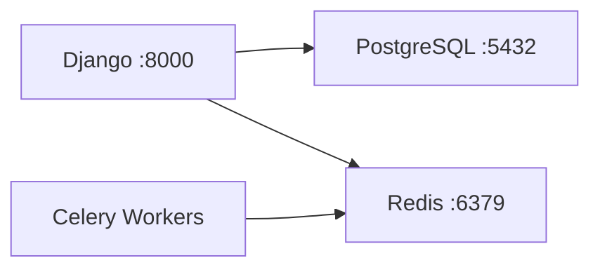

## Modular monolith implemented with Domain-Driven Design

This is a pet project that I have implemented to better understand such concepts as design and architecture in software development. There are a bunch of large-scale flaws, and some of my adjustments
in the project, implemented during development. Additionally, keep in mind that the DDD/Modular monolith approach is a huge overhead for the project. 
So don't treat it as a representation of pure DDD or a fully functional instance.

### Overview

Initially, this was a project of the e-commerce online store "Electro" with the Django framework as a full technical stack. Since my main concerns were the design and architecture themselves
I reused and refactored the old project instead of creating a new one. The front-end was taken from https://colorlib.com/. It uses legacy frontend technologies, which caused some trouble 
applying new standards like OAuth 2.0. However, there are no adjustments on the front-end except for a few endpoints, so there won't be any front-end-related stuff down below.

#### Features of the e-commerce store

- interface (home page, store page, product page, log in, sign up)
- products/goods workflow (storage -> user's cart -> order)
- cart/wishlist
- payments (Stripe API)
- delivery (Shippo API)

## 🏗 Architecture

A **single-machine deployment** where components communicate via local ports, managed through Python's virtual environment.

#### Component Breakdown
| Component      | Role                                 | Communication Method          |
|----------------|--------------------------------------|-------------------------------|
| **Django**     | Core application (HTTP/API)          | Exposes ports (`:8000`)       | 
| **PostgreSQL** | Primary database                     | Django connects via `psycopg2`|
| **Redis**      | Cache + Celery broker + Storage      | Django/Celery use `redis   `  |
| **Celery**     | Async task queue                     | Listens to Redis for jobs     |

#### Key Characteristics
- **Local Development Focus**: All services run on one machine
- **Virtual Env Isolation**: Python dependencies are sandboxed
- **Port-Based Communication**:
  - Django → PostgreSQL: `5432`
  - Django → Redis: `6379`
  - Celery ↔ Redis: Message queue

#### Infrastructure Diagram


### Design

I have implemented the DDD approach for the modular monolith, where each bounded context (BCs below) has its own directory under /core on the project root. There are seven BCs, some of which are still
not fully implemented or refactored to DDD, though these BCs have all the crucial logic.

#### Bounded Contexts
| Bounded Context             | Role                                                                               | Development Status                         |
|-----------------------------|------------------------------------------------------------------------------------|--------------------------------------------|
| **shop_management**         | Core BC that acts as an intermediate module for other BCs                          | In progress                                | 
| **user_management**         | Handles user authentication (login/signup), authorization, and profile management. | Finished (there might be small adjustments)|
| **cart_management**         | Contain all logic related to carts and wishlists                                   | Finished                                   |
| **review_management**       | Manages product reviews                                                            | Finished                                   |
| **notification_management** | Sends emails out as a response to EDD events using an external API (Mailchimp)     | Not refactored                             |
| **order_management**        | Operates with product orders and users' carts via an external API (Shippo)         | Not refactored                             |
| **payment_management**      | Handles transactions and payments for users' orders                                | Not refactored                             |

As you can see, the project isn't fully implemented. There are some not refactored BCs, which have a small portion of business logic due to dependence on external APIs. Additionally, there are
a couple of significant design flaws across multiple BCs related to bad design decisions in the early stages of refactoring (yep, I am too lazy for all that stuff). By the way, there are /core/utils
and /core/presentation directories, which aren't BCs. These two have dedicated purposes; the first one is a directory that contains the code shared between BCs and some protocols for enforcing
standalone rules; the second one is the Django project application that contains the settings.py file.

#### Applied DDD concepts and patterns
- A layered structure of BCs, each one of which has a domain, application, infrastructure, and presentation layers.
- A repository pattern
- Domain components: aggregates, entities, and value objects
- Application layer Use Cases that orchestrate all dependencies from other layers
- Anti-Corruption Layer for each BC
- Domain events

#### Applied patterns
- Event-Driven Design implemented with Celery
- Observer pattern/Event bus
- Factories and Dependency injectors
- Facades, Adapters, and Singletons
- CQRS (Command Query Responsibility Segregation)

These patterns and concepts are all I still remember, but surely there is a lot of stuff down there, like DTOs, mappers, and adapters (infrastructure components used with interfaces).

#### Major Design Flaws

To be honest, there are way more flaws in this project than I would have wanted. However, I will recount only the huge ones that really should be corrected in the first place, and plus-one as a reminder.

##### Scattered ACLs

I should have understood it from the acronym alone, but English is my second language, and it seems that my brain is too stubborn to pay attention to acronyms. I thought that scattered ACLs in BCs
wouldn't be such a pain for such small scales, but it really should be kept in a dedicated layer. Maybe I should have been using simple facades instead of a whole ACL; it would fit way better into
the picture.

##### States of aggregates and entities

The second major issue that must be kept accountable is the state of each aggregate or entity in the domain layer. How should I put this? You can treat this issue as a direct violation of DDD
principles. Aggregates and entities are domain components that have to handle all business logic in DDD. Thus, we have to be sure that the domain modules' states match the actual data from
the database. Which is not the case in my DDD implementation. I had no particular reason to violate DDD principles, but I didn't like the fact that I simply followed generally accepted rules
while designing my system. So I just broke the peace and decided to use domain modules for read operations, which not only violates DDD, but also the Single Responsibility Principle. Not the best
design decision I could have made, but I am kinda fine with it considering the purpose of the project.

##### Huge DDD overhead

This project was chosen by me due to its simplicity and DDD's core idea, which would perfectly fit into this project. However, it would be so only if the scale of the project required such an
approach. In other words, this flaw was designed into the project from the very beginning.

### Technical stack

- Django backend framework
- PostgreSQL object-relational database
- Redis storage
- Celery task queue implementation
- Docker compose

### APIs

- Stripe (payments)
- Shippo (delivery)
- Mailchimp (emails)

### Running the project

Clone the docker_setup branch:
```bash
git clone -b docker_setup https://github.com/pickle-slime/modular_monolith.git
```
Make sure there are no other Redis, PostgreSQL, or Nginx instances running locally. Stop or disable them as needed.

Then navigate to the project root and create the .env file, along with RSA keys:
```bash
cd modular_monolith
touch .env
```

#### .env
```bash
BOUNDED_CONTEXTS="shop_management,user_management,cart_management,review_management,notification_management,order_management,payment_management"

# Postgres
POSTGRES_DB="electro"
POSTGRES_USER="electro_admin"
POSTGRES_PASSWORD="electro299792458"
POSTGRES_HOST="postgres"
POSTGRES_PORT="5432"

# Redis
REDIS_HOST="redis"
REDIS_PORT="6379"

# APIs
SECRET_KEY="django-insecure-somekey"  # any random string

# JWT Keys
JWT_SECRET_KEY=""
JWT_PUBLIC_KEY=""
```

Insert the contents of private.key and public.key into JWT_SECRET_KEY and JWT_PUBLIC_KEY in .env accordingly.

#### RSA Key Generation
```bash
openssl genpkey -algorithm RSA -out private.key -pkeyopt rsa_keygen_bits:2048
openssl rsa -pubout -in private.key -out public.key
```

#### Running the App
```bash
cd ../docker
docker compose build
docker compose up -d
```

### License
- MIT License
